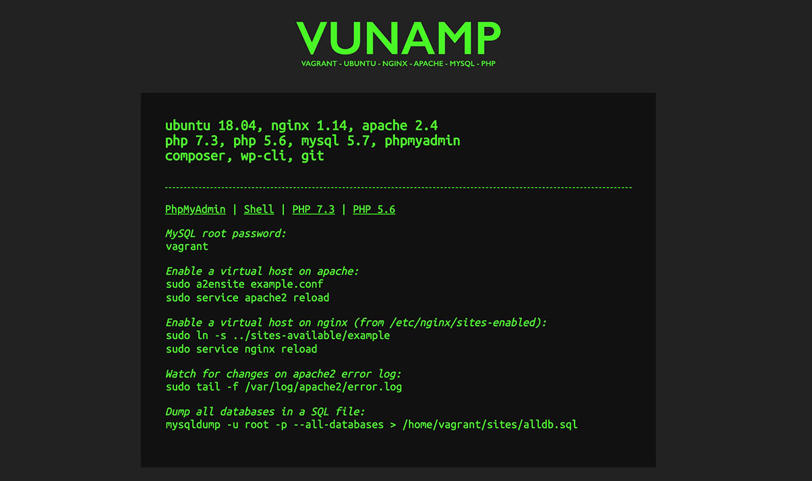

# VUNAMP

VUNAMP is a php development stack based on **Vagrant** and **Ubuntu 18.04**. It includes:
- nginx 1.14 
- apache 2.4
- php 7.3 and 5.6 (fpm) 
- mysql 5.7 
- phpmyadmin
- shellinabox (to access the box in a terminal from your browser)
- composer
- wp-cli
- git

It works on any environement that supports **virtualbox** and **vagrant**. Basic linux knowledge is necessary.

## Requirements

- Virtualbox: https://www.virtualbox.org/wiki/Downloads 
- Vagrant: https://www.vagrantup.com/downloads.html 

For optimal performances, install these plugins:

- Vagrant faster: https://github.com/rdsubhas/vagrant-faster
- Vagrant winnfsd (for windows machines): https://github.com/winnfsd/vagrant-winnfsd

## Installation

Clone this repository on your computer. Create a **config.yml** file, based on **config.example.yml**, and customise it to your own needs. You can turn **nfs** on or off, share folders and redirect ports. 

Open the directory in your favourite terminal and run:
```
vagrant up
```

If you haven't changed the default http port, you should be able to access the homepage in a browser:
http://localhost:8080



## Installing new sites

You are entirely free to choose how to run websites, having access to the virtual hosts folders of both apache and nginx, in **vhosts_apache** and **vhosts_nginx**. Whatever local domain you choose to use, you'll have to manually add the below line to your **hosts** file (*/etc/hosts* on Mac, *C:\Windows\System32\Drivers\etc\hosts* on Windows):
```
127.0.0.1   example.test
```

Inside the box, **nginx** works on port **80** and **apache** on port **8080**. All the traffic is proxy-reversed to **apache** by default. However, you can choose to use **nginx** instead with a custom local domain. You are also free to choose what version of **php** to run. Both php 7.3 and 5.6 run with **php-fpm**.

That allows to run each website on either nginx or apache and php 7.3 or 5.6.
You will find below different sample vhost conf files.

### nginx/php7.3

```
# /etc/nginx/sites-available/example

server {
        listen 80;
        listen [::]:80;

        root /home/vagrant/sites/example;
        index index.html index.htm index.nginx-debian.html index.php;
        server_name example.test;

        location / {
            try_files $uri $uri/ /index.php?$args;
        }

        location ~ \.php$ {
        	fastcgi_pass unix:/run/php/php7.3-fpm.sock;
            fastcgi_index index.php;
            fastcgi_param SCRIPT_FILENAME $document_root$fastcgi_script_name;
		    include fastcgi_params;
	}
}
```

To activate this site, as **root** from */etc/nginx/sites-enabled*:

```
ln -s ../sites-available/example
service nginx reload
```

To switch to php 5.6, just amend the **fastcgi_pass** line in the **location** block and change 7.3 to 5.6.

### apache/php5.6

```
# /etc/apache2/sites-available/example.conf

<VirtualHost *:8080>
	
	ServerName example.test
	ServerAdmin webmaster@localhost
	DocumentRoot /home/vagrant/sites/example
	ErrorLog ${APACHE_LOG_DIR}/error.log
	CustomLog ${APACHE_LOG_DIR}/access.log combined

	<Directory "/home/vagrant/sites/example">
        Options Indexes FollowSymLinks
        Require all granted
        AllowOverride All
    </Directory>

    <FilesMatch \.php$>
        SetHandler "proxy:unix:/var/run/php/php5.6-fpm.sock|fcgi://localhost/"
    </FilesMatch>

</VirtualHost>
```

To activate this site, as **root**:

```
a2ensite example.conf
service apache2 reload
```

To switch to php 7.3, just comment the **FilesMatch** block (php 7.3 is the default).